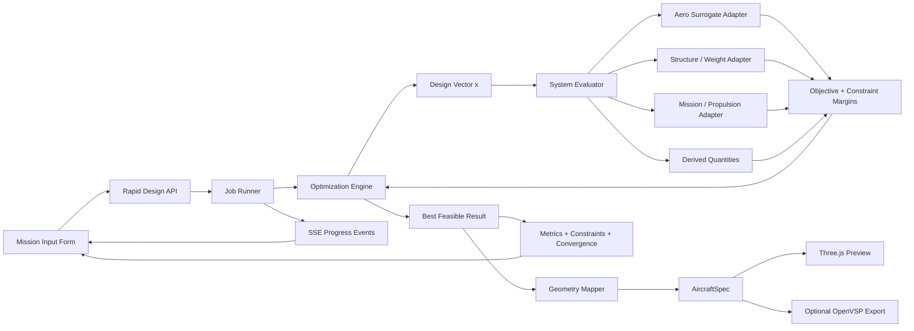

# Rapid Aircraft Design Demo：总体实施计划

**版本：** V0.1  
**日期：** 2026-09-03  
**目标：** 先把“任务需求 → 快速优化 → 飞机形状 → 结果展示”的完整工程链路跑通；暂不把不确定性、conformal prediction、模型再训练或论文创新设为前置条件。

---

## 0. 一句话结论

最快且风险最低的路线是：**fork 现成的 AeroSpec Agent 作为 HTML 前端、任务流和三维显示外壳，再新增一条完全不依赖 LLM 的数值优化路径，把老师提供的 surrogate models 通过统一 adapter 接入，最后将最优可行设计映射成 `AircraftSpec` 并用 Three.js 立即显示。**

这不是先造一套“大而全”的 aircraft design platform，而是先完成一个可靠的 vertical slice：

```text
网页输入任务参数
    ↓
启动本地优化任务
    ↓
调用现成 surrogate models
    ↓
计算 objective + constraints
    ↓
搜索当前模型和边界下的最优可行设计
    ↓
生成概念飞机几何
    ↓
网页显示 3D 飞机、关键指标、约束和优化过程
```

第一版完全可以在个人电脑本地运行，不需要服务器。

---

## 1. 最终 Demo 应该长什么样

用户打开本地网页，例如：

```text
http://localhost:3900/rapid-design
```

页面包含三个主要区域。

### 左侧：任务需求输入

第一版只保留真正需要的字段，具体字段由 YAML 配置控制，例如：

- Payload
- Required range
- Cruise speed
- Cruise altitude
- Endurance
- Take-off distance / runway limit

优化变量、上下界、目标函数和约束默认放在折叠的“Advanced Configuration”中，老师以后修改 YAML 即可，不要求改前端代码。

### 中间：飞机三维模型

优化结束后立即显示：

- fuselage
- main wing
- horizontal tail
- vertical tail
- engine / propulsor 的概念位置

V0 只支持 **conventional tube-and-wing aircraft**。先把最常规布局跑通，不同时支持飞翼、鸭翼、双翼、BWB 等布局。

### 右侧：优化结果

显示：

- 当前模型与边界下的 **best feasible design**
- objective value，例如 MTOW、range、fuel weight 或其他老师指定目标
- 主要 design variables
- 各 surrogate 输出
- 每个 constraint 的 target、actual value 和 margin
- feasible / infeasible 状态
- runtime、evaluation count、random seed
- 使用的 model version 和 config version

页面底部显示优化收敛曲线和运行日志。运行中必须有实时进度，而不是点击后长时间无反应。

---

## 2. V0 做什么，不做什么

### V0 必须做

1. 本地网页表单能够提交任务需求。
2. 后端能够启动一个独立 optimization job。
3. optimizer 能调用一个或多个 surrogate adapter。
4. objective、constraints、variables 和 bounds 全部从配置读取。
5. 前端能够实时看到进度。
6. 优化结束后显示 3D 概念飞机。
7. 显示完整数值结果和约束可行性。
8. 保存每次运行的输入、配置、模型版本、结果和日志。
9. 在真实 surrogate 尚未接入时，用 deterministic mock models 跑通整条链路。
10. 替换 mock model 为真实 model 时，不需要修改 optimizer 和前端。

### V0 明确不做

- CFD 或 FEA
- surrogate model 训练
- confidence interval、conformal prediction、Bayesian uncertainty
- multi-fidelity learning
- multi-objective Pareto front
- 任意飞机布局
- cloud deployment、用户账号、数据库和权限系统
- OpenMDAO / FAST-OAD / Aviary 的全面接入
- certification 或 airworthiness-level validation
- 声称所得结果是数学意义上的 global optimum

用户界面应称结果为：

> **Best feasible design found under the current models, bounds, constraints and search budget.**

中文可写为：

> **当前模型、边界、约束和搜索预算下找到的最优可行设计。**

---

## 3. 为什么建议复用 AeroSpec Agent，而不是从零写

截至本计划调研时，`zweien/aero-spec-agent` 已经包含：

- Next.js + React 前端
- FastAPI 后端
- HTTP / SSE 实时事件流
- Three.js 三维显示
- 参数化 `AircraftSpec`
- Fake CAD backend
- OpenVSP backend
- OBJ / GLB 等模型输出路径
- job、version、storage 和 tests 的工程骨架

它当前的核心路径偏向：

```text
自然语言 → LLM → AircraftSpec → CAD / 3D / performance estimates
```

我们需要新增一条互不干扰的路径：

```text
任务表单 → numerical optimizer → surrogate models → AircraftSpec → 3D / metrics
```

也就是说，不改坏原来的聊天设计功能，而是在同一项目中新增 `/rapid-design` 页面和 `/api/rapid-design/*` API。

### 需要保留的部分

- `CadViewer`
- `AircraftThreePreview`
- Three.js / GLB loader
- job event bus
- SSE 事件格式
- storage/version 机制
- FastAPI 和 Next.js 工程配置
- Fake backend，用于没有 OpenVSP 时测试
- 已有测试习惯

### 不应直接拿来作为优化物理模型的部分

现有 `performance_estimate.py` 中包含不少经验常数和简化关系。它适合界面演示与 sanity check，但**不应直接充当我们最后优化结论的 surrogate source of truth**。真正的优化输出应来自明确登记的外部 surrogate adapters。

---

## 4. 推荐系统架构



### 关键设计原则

#### 1. Surrogate 只是可替换计算器

系统不应该绑定某一个模型格式。每个模型都通过统一接口：

```text
canonical inputs → adapter → borrowed model → canonical outputs
```

以后可以替换为：

- Python function
- scikit-learn / joblib
- PyTorch
- ONNX
- external executable
- OpenMDAO component

而 optimizer、API 和 UI 不变。

#### 2. 后端统一使用 SI units

所有内部变量统一使用：

- m
- m²
- m³
- kg
- N
- Pa
- m/s
- s
- radians，除非明确以 `_deg` 命名

前端可显示 km、km/h、hours，但进入后端时立刻转换为 SI。

#### 3. 任务需求、设计变量和三维几何是三个不同对象

不要把所有信息硬塞进一个 schema。

- `MissionRequirements`：用户要求什么
- `DesignVector`：optimizer 在改变什么
- `AircraftSpec`：网页和 CAD 怎样画飞机

中间用 `GeometryMapper` 转换。

#### 4. CAD 不进入每一次 objective evaluation

优化可能评估数百次 candidate。每次都生成 CAD 会无意义地拖慢运行。

正确流程是：

```text
数百次 surrogate evaluation
    ↓
得到 best design
    ↓
只对最终设计生成一次 3D geometry
```

---

## 5. 优化层的最小设计

### 5.1 配置驱动

老师以后只需要修改配置，不需要修改 UI 或 optimizer 代码。

```yaml
variables:
  - name: wing_area_m2
    lower: 10.0
    upper: 40.0
    initial: 22.0

  - name: aspect_ratio
    lower: 6.0
    upper: 16.0
    initial: 10.0

objective:
  output: mtow_kg
  sense: min

constraints:
  - name: range_requirement
    output: achieved_range_m
    operator: ">="
    target_from: mission.required_range_m

  - name: stress_limit
    output: max_stress_pa
    operator: "<="
    target: 250000000.0
```

上面的数字只是 schema 示例，不是最终 engineering settings。

### 5.2 第一版 optimizer

真实 surrogate 很可能是 black-box，未必有可用梯度。因此 V0 推荐：

- 默认：`scipy.optimize.differential_evolution`
- 可选：最后用 SLSQP 做一次 local polishing
- 所有参数由 YAML 控制
- 固定 seed，保证可复现
- 每个 generation 发 SSE progress event
- 对模型报错、NaN 和超范围返回 penalty，而不是让整个 job 崩掉

如果以后模型全部可微，再考虑 AeroSandbox、OpenMDAO 或 IPOPT。

### 5.3 统一约束 margin

所有约束统一成：

```text
margin >= 0  → feasible
margin < 0   → violated
```

例如：

```text
要求 y >= target: margin = y - target
要求 y <= target: margin = target - y
```

这样前端只需处理一种逻辑。

### 5.4 没找到可行解时怎么办

不能假装已经优化成功。返回：

- `status: no_feasible_solution_found`
- violation 最小的 candidate
- 每个 constraint 的 violation
- search budget 和 bounds
- 建议检查是否任务要求本身不可达

---

## 6. 三维飞机如何从优化变量生成

V0 只需要一个稳定、可解释的 geometry mapping。例如 surrogate 的设计变量包含：

- wing area `S`
- aspect ratio `AR`
- taper ratio `lambda`
- sweep
- fuselage length
- fuselage diameter

则可直接得到：

```text
span = sqrt(AR * S)

root_chord = 2S / [span * (1 + taper_ratio)]

tip_chord = taper_ratio * root_chord
```

随后构造 `AircraftSpec`，交给现有 Three.js preview。

尾翼尺寸若尚未作为优化变量，可先由配置默认值或 tail volume coefficient 映射。所有默认值必须在结果里标记为 `derived` 或 `defaulted`，不能让用户误以为它们来自 surrogate。

OpenVSP 可以作为后续可选输出，但 **V0 不应因 OpenVSP 安装失败而无法演示**。Three.js 参数预览必须始终可用。

---

## 7. Confidence / conformal 的预留方式

V0 不计算 confidence interval，但从一开始保留字段：

```json
{
  "uncertainty": {
    "status": "not_implemented",
    "method": null,
    "lower": null,
    "upper": null
  },
  "validity": {
    "status": "not_evaluated",
    "score": null,
    "message": "Uncertainty and conformal validity are not enabled in V0."
  }
}
```

前端显示：

> Uncertainty: Not evaluated in this demo

不要伪造 confidence，不要把“模型能输出一个数”包装成“模型对此有高置信度”。

以后加入 conformal/UQ 时只扩展 adapter 输出，不需要重写页面和 optimizer 主结构。

---

## 8. 实施顺序与预计时间

### 阶段 A：Vertical slice，约 0.5–1 天

目标：哪怕只有 mock model，也能从网页输入一路跑到飞机和结果。

- fork 并在本地跑通 AeroSpec Agent
- 新增 `/rapid-design` 页面
- 新增 `/api/rapid-design/jobs`
- 使用 deterministic mock evaluator
- 生成固定但随输入变化的 `AircraftSpec`
- 显示进度、三维飞机和结果

这一步完成后，系统已经“活了”。

### 阶段 B：真实 optimization shell，约 1 天

- YAML 读取 variables / bounds / objective / constraints
- SciPy optimizer
- standardized constraint margins
- convergence history
- infeasible handling
- deterministic seed
- result persistence

### 阶段 C：接入第一组 borrowed models，约 1–2 天

- 为老师选定的第一个模型写 adapter
- 对齐单位、输入顺序、normalization 和输出名
- model load only once
- 与 mock adapter 做 A/B smoke test
- 完成 geometry mapping

### 阶段 D：Demo hardening，约 1 天

- 异常提示
- 页面刷新后重新连接 job
- 导出 JSON / Markdown report
- end-to-end tests
- 一键启动脚本
- 录制演示

### 总体判断

- **1 天：** 可以得到从输入到飞机的 vertical slice。
- **3–5 个工作日：** 在模型接口清晰的情况下，可以得到可展示的完整 V0。
- **1–2 周：** 如果 borrowed models 存在依赖冲突、输入定义不清、单位不一致或强耦合，时间主要会耗在模型接口清理，而不是网页或算力。

---

## 9. 老师后续只需要确认的三类信息

### 1. Model contract

对每个 borrowed model 给出：

- 模型文件或代码入口
- inputs 的名字、顺序和单位
- normalization
- outputs 的名字和单位
- valid input range
- model source、version 和 license

### 2. Optimization definition

- design variables
- lower / upper bounds
- objective
- constraints
- search budget / solver settings

### 3. Geometry mapping

哪些 design variables 直接控制：

- wing
- fuselage
- tail
- propulsion placement

哪些变量只影响性能，不影响三维外形。

除此之外的框架部分可以先独立搭建。

---

## 10. 主要风险，以及最短处理方式

| 风险 | 本质 | V0 处理 |
|---|---|---|
| 不同模型单位不一致 | 接口问题，不是 optimizer 问题 | 后端只接受 canonical SI，adapter 内转换 |
| 不同模型使用不同变量名 | schema 问题 | model manifest 明确 mapping |
| 模型每次重复加载很慢 | 生命周期问题 | server startup 时 load once |
| optimizer 找到 NaN 或异常区域 | black-box 模型问题 | finite checks + penalty + bounds |
| 没有可行解 | 任务/边界冲突 | 明确显示 infeasible，不伪造成功 |
| OpenVSP 环境难装 | native dependency 问题 | V0 默认 Three.js preview，OpenVSP optional |
| 网页只展示外形，看不出工程价值 | 信息设计问题 | 同时展示 constraints、margins、objective 和 provenance |
| borrowed model 许可不清 | 研究合规问题 | 建立 `THIRD_PARTY_MODELS.md`，不随意分发 weights |
| optimizer “利用”模型错误 | model validity 问题 | V0 限定 bounds；UQ/OOD 后续接入 |
| 上游项目变化 | dependency stability | pin commit、保留测试、在自己的 fork 开发 |

---

## 11. Definition of Done

V0 被视为完成，必须同时满足：

1. 一条命令或两个明确命令启动本地前后端。
2. 不需要 LLM API key 也能使用 `/rapid-design`。
3. 用户可在浏览器输入任务需求并启动 job。
4. 优化期间持续显示阶段和百分比/迭代进度。
5. demo model 情况下 60 秒内返回结果。
6. 返回 interactive aircraft preview。
7. 显示 objective、design variables、model outputs、constraints 和 margins。
8. 没有可行解时明确报告，而不是展示“最优”。
9. 每个 run 保存 request、config、seed、model versions、result 和 convergence。
10. 替换第一个 surrogate 只需要增加 adapter/config，不重写前端和 optimizer。
11. 相同 seed 和相同配置产生可复现结果。
12. 至少存在一个 end-to-end automated test。

---

## 12. 最终推荐

现在不要从 OpenMDAO、FAST-OAD 或全新的前端开始，也不要先讨论 confidence interval。

**先在 AeroSpec Agent 上做一条独立的 `/rapid-design` 数值路径：**

```text
Mission Form
→ Config-driven Optimizer
→ Surrogate Adapters
→ Best Feasible Design
→ AircraftSpec
→ Three.js
→ Metrics / Constraints / Report
```

这是目前最接近“几天内把想法变成能看的东西”的方案，同时又给未来的 surrogate、MDO、UQ、conformal 和论文工作保留了干净接口。
