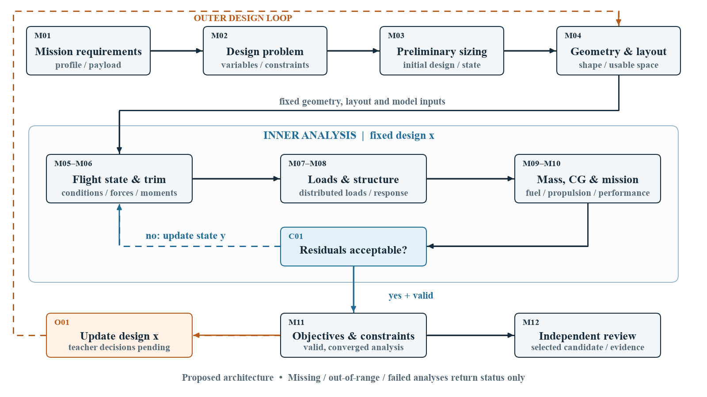
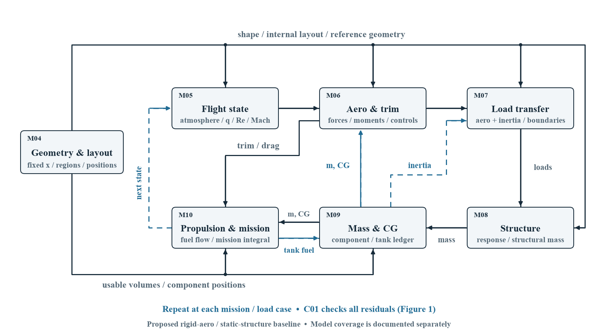

# BWB 传统飞机概念设计：计算闭环与验证规格

> 2026-09-10归档：用户反馈当前pipeline图可读性不足，待其提供模板与学术参考后修订。本分支保存现有文档、图和独立三维演示；此前的目视检查记录不代表用户已认可图的可读性。

审阅日期：2026-09-09。状态：**正式BWB计算与验证规格；未完成整机验证或优化。用户随后追加的独立本地演示已实现并运行有限的简化计算，见第11节。** BWB 是首个有边界的研究案例。模块编号 M01–M12、分析收敛门 C01、外层更新 O01 在正文和图中保持一致。

本轮交付回答的是：给定需求，怎样构造一个候选飞机；固定它以后怎样求出相互一致的状态；怎样判定计算有效、满足约束，以及还需要什么独立证据。手绘图中的 L=W 只适用于相应飞行假设；含糊的容积数字、最小 CD 目标、应力阈值均没有升级成项目要求。

## 1. 阅读入口与证据等级



**图 1：工程主线与两个循环。** 主图把 M05–M10 合为三个学科组；分布载荷、重心与燃油反馈在图 2 展开。蓝色虚线只在固定设计内更新分析状态，橙色虚线才修改设计。所有框都是本轮规格的位置，不表示相应模块已接通。C01 通过仅代表分析一致；M11 评价可行性；M12 形成独立复核证据。



**图 2：固定候选设计的分析依赖。** 几何/内部布局同时决定气动边界、结构和可用空间；质量/重心影响配平及惯性载荷；配平后的阻力进入任务积分；燃油分配再改变质量/重心。图中反馈需对任务节点及指定结构载荷工况分别索引，不能用一个巡航点代替全部包线。

| 标记 | 本文含义 |
|---|---|
| `checked_existing` | 本轮实际读过代码、字段或文件，或执行了明确记录的接口检查；不等于物理验证 |
| `existing_unvalidated` | 资源存在，但准确性、适配或独立复现未完成 |
| `proposed` | 本轮提出的方程、接口或验证方案；没有据此声称已实现 |
| `missing_model` / `missing_evidence` | 缺少可调用模型、必要输入、来源或独立证据 |
| `pending_teacher_decision` | 正式目标、变量、阈值、模型使用范围或验收条件待老师确认 |

## 2. 项目和 MIT/nTop 核查

### 2.1 已检查的本地基线

| 对象 | 本轮实际状态与范围 |
|---|---|
| RapidProcessDesign | `D:\DeskTop\2711\RapidProcessDesign`；分支 `codex/round8-simple-design-flow`，提交 `5e63b929a7f44a627d1bcb2bc6d42f3f30f54255`；origin 为用户提供的 hongyi-lab 仓库 |
| 原有工作区 | 开始时 `docs/rapid-design.md` 已修改，`classreference/`、`demo_result/`、`revision/`、`docs/evidence/` 和 `docs/demo-observations-2026-09-06-cn.md` 含未跟踪内容；本轮仅添加本说明、图源/图和专用审计记录 |
| MIT/nTop | `D:\DeskTop\2711\MIT\official_hackathon`；`main`，提交 `b516d4b3e2e5e34fbd5233eacdf15317a96dc2d9`，已跟踪文件开始时无变更 |
| 远程状态 | 浏览器检索读取了官方 hackathon README 与论文；shell 的 `ls-remote` 因网络连接失败，未确认远程最新提交。以下代码结论固定在上述本地提交，不声称与远程 HEAD 完全一致 |
| 手绘图 | 已阅读两张原图：保留“任务→设计”“气动/结构→约束”的意图，补充力矩、分布载荷、重心、推进与燃油依赖；不采纳不清楚的数字 |

现有 BWB 在 [bwb_analysis.py](../services/api/app/services/rapid_design/bwb_analysis.py) 中明确为 `clean-room-bwb-low-order`：几何数值积分、有限翼升力斜率、摩擦阻力、抛物诱导阻力、经验高攻角饱和，返回 CL/CD/L/D 和 `volume_proxy_m3`，未提供 Cm、配平、分布载荷或应力。`_decode_geometry` 把 B1/B2/B3 作为累计前的分段翼展，并用 `0.25*c1*x3_ratio` 调整转折；不能把这些参数直接当成 MIT 几何。其容积代理也不是已经分配好的载荷舱/油箱。

常规布局在 [cruise.py](../services/api/app/services/rapid_design/cruise.py) 已有三燃油质量节点配平、功率检查和 Simpson 燃油积分；[mission_demo.py](../services/api/app/services/rapid_design/mission_demo.py) 仍使用面积/翼展系数质量模型。固定假设重心并非部件重心闭合。这些是可复用的实现经验，不证明 BWB 已具备这些能力。本轮未重跑旧系统测试，也不沿用 README 的测试数量作为当前验证证据。

历史[老师待确认文档](teacher-decisions-optimization-spec-cn.md)中“无配平、固定 TSFC 航程”的摘要落后于当前常规布局实现；以当前代码和 [physics-upgrade.md](physics-upgrade.md) 为已有能力依据。其正式决策仍保持待确认，没有自动沿用常规布局演示中的 5% 静稳定裕度、动力参数或搜索算法。

### 2.2 哪些资源能填进哪些模块

下列代码、README 和数据均在本地提交核查；链接指向固定提交，便于独立追溯。

| 资源 | 实际输入/输出与证据 | 对应模块与缺口 |
|---|---|---|
| [积分气动接口](https://github.com/nicksungg/nTop---ASME-IDETC-CIE-Student-Hackathon/blob/b516d4b3e2e5e34fbd5233eacdf15317a96dc2d9/models/ld_surrogate/predict_ld.py) | `predict_ld(geom, alt_kft, kcas, aoa)`；输出 CL、CD、LD、Re_L、M_inf、warnings。已实际调用；NumPy MLP 权重以 JSON 提供 | M06 的升阻预测；**没有 Cm、舵偏输入/响应、推力线矩或表面载荷**；不能独立闭合配平与结构 |
| [飞行条件转换](https://github.com/nicksungg/nTop---ASME-IDETC-CIE-Student-Hackathon/blob/b516d4b3e2e5e34fbd5233eacdf15317a96dc2d9/models/ld_surrogate/flight_conversion.py) | ISA、可压缩 CAS→Mach、Re 与特征组装；参考 Re 长度为 C1；已读代码并做有限代数检查 | M05 可参考；`features_structural` 仅组装 24 个数，**不是结构预测器** |
| [结构 CSV](https://github.com/nicksungg/nTop---ASME-IDETC-CIE-Student-Hackathon/blob/b516d4b3e2e5e34fbd5233eacdf15317a96dc2d9/data/bwb_structures_dataset.csv) | 实测 13,720×28，24 输入、4 输出；全部数值且有限。输出结构质量、两种容积、热点应力 | 为 M04/M08 提供离线参考标签；没有任意输入可调用结构权重，没有 CG、位移、FE 节点场或可重新组合的载荷接口 |
| [nTop 文件说明](https://github.com/nicksungg/nTop---ASME-IDETC-CIE-Student-Hackathon/blob/b516d4b3e2e5e34fbd5233eacdf15317a96dc2d9/ntop_model/README.md) | 本地存在 15,396,008 字节 `.ntop`，说明强调参数化结构可视化；本轮没有在 nTop 打开/求解 | M04 的几何/结构布局候选工具；不能据文件存在推定可独立重跑全部载荷和 FE 流程 |
| BlendedNet++ 论文 | §3 描述系数和表面场数据；§5.7 的训练输出为 Cp、Cfx、Cfz 三通道；§7.1 表 8 是点场误差 | 潜在补充 M06/M07；**论文有某量 ≠ 当前 wrapper 或本地文件有可调用接口**。未在本次参考仓库已跟踪文件发现 `fields.py`、FiLMNet 权重或场数据包；未取得或运行完整场模型 |
| 现有项目分析 | 已读 BWB decoder/polar、family adapter、常规 cruise、mission mass 和相关文档 | 保留，可按本规格补接口；当前无完整 BWB 工程闭环 |

#### 积分气动的输入、单位和参考量

外部输入为 10 个几何量与 3 个工况量：`B1/C1,B2/C1,B3/C1,C2/C1,C3/C1,C4/C1,S1,S3,X3/C1,C1`，加 `Altitude[kft],KCAS[kt],AOA[deg]`。六个长度比乘以 1000，后掠角及 X3/C1 直接传入；C1[mm] 只通过 `Re_L=ρ V_true (C1/1000)/μ` 进入第 10 个特征（从零计数索引 9），总计 12 特征。不能把 C1 直接塞入网络或将 X3/C1 再乘 1000。

系数→力的关键缺口：论文 §3 “CFD Simulation” 给出规范几何 C1=1 m、S_ref=1 m²、l_ref=1 m，力矩参考点在机鼻。**本地 wrapper 未返回参考面积、矩参考点，也没有数据预处理包来证明导出的 CL/CD 完全沿用此归一化。** 在这一来源关系核实前，标记 `reference_metadata_unconfirmed`，只允许报告系数，不能默认 `L=q*S_project*CL`。

若确认上述固定参考量沿用，且是严格相似缩放，令 λ=C1_actual/(1 m)，应取 S_ref,actual=λ²·1 m²、l_ref,actual=λ·1 m；L=q S_ref,actual CL，M_nose=q S_ref,actual l_ref,actual Cm。若要改为平面面积 S_planform，先换算 `CL_planform=CL*S_ref,actual/S_planform`，而非保持 CL 不变。Re、Mach 仍须按真实工况重新计算；不同翼型、厚度、扭转、舵面或机身细节不是尺度相似。

#### 适用范围不是一个统一的盒子

| 层级 | 已核实范围/行为 | 本轮提出的接入规则 |
|---|---|---|
| 气动 JSON 几何盒 | B1/B2/B3 在 1 m 基准上约 100–200 / 50–200 / 350–700 mm；C2/C3/C4 约 550–850 / 180–280 / 60–90 mm；S1≈40–60°、S3≈20–44.9884°、X3/C1≈0.5–0.6499 | 使用文件中的精确值；所有条件先检查再调用。这里是资源范围，不是项目优化边界 |
| 实际结构 CSV | C1≈2500–4000 mm；S3 上限约40°；结构整数轴单独处理，机身肋数仅 {3,5,7,9,11} | 交集仍不能证明全组合有覆盖；固定载荷历史不能外推到新载荷包线 |
| 转换器检查 | Re∈[5.07e4,1e8]，Mach∈[0.05,0.5]；另检查 Altitude/KCAS/AOA。JSON 的 `flight_bounds` 更窄，且注释说来自 feasible subset | 同时记录两组来源。不能悄悄挑较宽范围消除警告；精确用途边界待确认 |
| 单点/批量接口 | 单点只检查飞行状态，**没有几何边界检查**；批量只返回 LD 数组，没有逐样本 warnings，也没有 CD>0 的物理有效性门 | 接入时补几何/工况/有限值/正阻力门。不能把空 warnings 当作 `in_domain`，不能用 clip 隐藏负阻力 |

本轮用 S3=60° 的故意越界输入实测仍返回 `warnings=[]`。18 kft、250 KCAS 的示例得到 Mach=0.526039，并返回速度/Mach 警告。逐行按 CSV 自带工况运行**转换器**发现 66 条 Mach 警告、3 条高度警告、6 条 KCAS 警告（可重合）；不是“所有样本都只会有 Mach 警告”。这些是接口/范围审计，不是精度检验。

### 2.3 结构 schema 与说明的差异

| 差异 | 实际观察 | 工程处理 |
|---|---|---|
| 28 vs 30 列 | 根 README 与 CSV 为 28；`data/README.md` 写另一个文件名、30列、load_case/deflection，但输出表自身仅列4项。实际没有 load_case、deflection，stress 实名为 `Max Hotspot Stress` | 以 CSV 为接口真值；载荷历史只能标注“说明声称”，未逐行证实 |
| “unique” | 15 个完整重复行、18 个重复输入行（均按 `duplicated` 统计后出现的行） | 拟训练前按输入/几何分组隔离；相同输入但不同标签须追溯，不能跨训练/评估集泄漏 |
| 应力阈值/材料 | 根 README 用335 MPa；数据页335.3 MPa，同时出现333与503 MPa屈服强度描述；按335统计5611行超限，335.3则5607行 | 仅报告资源约定；材料牌号状态、厚度方向、许用值与安全系数须查可靠来源并由老师确认 |
| 热点应力 | 说明称5 mm球邻域平滑后取最大值；原始点云/计算代码未随 CSV 提供；123行>10⁴ MPa | 保留原始文件。拟建模时标注异常，不自动当作真实强度数据；“固定物理尺度”并不能代替网格收敛，节点等权平均仍可能随网格密度改变 |
| Cutout 单位 | 根 README 说 fraction，数据 README 写 m | `unit_semantics_unresolved`；未查清 nTop 端口前，不驱动几何或训练可迁移预测器 |
| 空重/容积语义 | `Aircraft Empty Weight` 单位kg、语义为结构质量；两体积为mm³（除以10⁹），不是质量 | 禁止当整机 operating empty mass，禁止直接等同任务需油量 |
| 载荷条件 | 数据页描述固定70 kg载荷和同时3g前向+2.5g横向+5g向下载荷；CSV没有这些可调输入 | 无法据 CSV 重新计算新载荷质量、CG、操纵机动或不同支承条件；这些历史载荷不构成本项目设计载荷要求 |

### 2.4 现成指标究竟评什么

| 对象 | 指标与来源 | 证据边界 |
|---|---|---|
| `reg_full.json`，n=9992 | CL R²=0.998613、MAE=0.004433；CD R²=0.993210、MAE=0.001160；L/D R²=0.989036、MAE=0.482559 | **权重文件内报告值，本轮未重算**。`regressor.py:train` 默认随机15%验证切分，且用该集选最佳 epoch；不是独立最终测试集 |
| `reg_feasible.json`，n=3860 | CL R²=0.998683、MAE=0.004316；CD R²=0.994778、MAE=0.000928；L/D R²=0.993661、MAE=0.404496 | 不同子集上的数字不可直接宣布更优；full README 的“most accurate”不构成此表的同集比较。feasible 也不是结构335 MPa可行集 |
| 气动论文表8 | Cp/Cfx/Cfz 的 MSE、MAE、RelL1、RelL2；另有逆设计目标达成比较 | 点场基准与当前两输出 MLP 不同；不能挪用为 wrapper 精度，更不能证明配平、载荷、结构或整机性能 |
| hackathon 评分 | 根 README “The scoring metric” 与1页评分PDF：0.4·M/M_ref + 三个0.2权重的 LD/燃油容积/载荷容积相对缺口 ReLU，超应力为无效。M_ref=50 kg 来自根 README，PDF只写符号 | 是竞赛排序。体积与LD在竞赛为soft targets，超应力为hard constraint；**不是本项目已经确认的目标/约束**，不是验证体系 |
| 本项目 C01 / M11 / M12 | C01：残差与一致性；M11：同一需求下目标/余量；M12：独立物理复核 | 四者（预测误差、分析一致、设计可行、优化表现）单列，不合成“验证通过” |

训练用 `regressor_data_full.npz` / `regressor_data_feasible.npz` 未在参考仓库已跟踪文件提供，因此不能复现上述精度。推理的 CD 直接作分母，而训练指标计算对 CD 使用 clip，指标和部署行为还有这一差异。

再利用边界：参考模型 README 含 MIT 版权与政府权利声明；根 README 声明本版 CFD/FEA 有已知局限、暂勿据此发表。没有把它解释为一般开源授权；本轮未复制数据/权重/nTop 到项目，也未发布任何材料。将来再分发/论文使用需落实资源方许可；查看、运行 nTop 需要安装与有效许可证。竞赛禁止外部求解器的条款仅约束其比赛，不阻止本项目提出独立 CFD/FEA 验证计划。

## 3. 数学对象、单位与状态契约

**r（需求）**：载荷质量及空间包络、分阶段航迹/速度/高度/时长或距离、备份燃油规则、起降及包线要求。需求不是状态方程的自由变量。**x（固定候选设计）**：抽象的几何、材料、结构厚度/拓扑、部件/油箱位置、推进选型以及被明确选作设计变量的容量。其最终分量和边界为 `pending_teacher_decision`。

**y（分析状态）**：每个任务节点/载荷工况的 α、控制偏角δ、油门/推力、载荷场、位移、质量和重心、各油箱存油、任务轨迹，以及若采用“满足任务反求燃油”时的初始燃油量。固定厚度下结构质量是由x确定的派生量，不应在内层偷偷增厚结构来降低应力。若未来采用内嵌结构尺寸优化，须另定义子问题，并承认它会更新设计分量。

建议以**需求给任务，内层反求满足任务的装油量**为审阅基线，不是最终选择。若老师选择“初始装油量属于x”，则内层保持它固定、预测可达航程/续航，余量进入M11；不得同时固定燃油与航程，又随意求其中一个。

| 接口公共字段 | 规定 |
|---|---|
| 识别与来源 | `design_id, design_hash, model_id/version, geometry_decoder_id, condition_id, load_case_id, iteration_id, source_commit`；初始猜测标记为 guess |
| 基本单位 | 内部m、kg、s、N、Pa、rad；文档/外部允许deg但边界显式换算。重量W=mg[N]，质量m[kg]。KCAS不是TAS；燃油密度kg/m³须带温度/来源 |
| 坐标 | 本规格建议右手体轴B：x向前、y向右、z向下；原点O为固定几何datum，重心位置另传。几何常见x向后的坐标必须提供正交变换Q和原点偏移；不能只改符号名称 |
| 参考量 | `S_ref_m2, l_ref_m, moment_ref_B_m, force_axes, angle_units`，区分实际几何面积与系数定义面积；变换矩 `M_CG=M_O+(r_O-r_CG)×F`，所有向量先转同一坐标系 |
| 有效性 | `availability={available,missing,failed}`；`domain={in,out,unknown}`；`convergence={converged,not_converged,not_applicable}`；`feasibility={feasible,infeasible,unknown}`；`evidence={planned,executed,reported_only}` 分开，不用一个bool代替 |
| 缺值 | 缺Cm、功率图、压力场等输出用null及reason，不用0冒充物理预测；携带残差、比较尺度、工况及适用假设 |

## 4. 逐模块计算规格

以下均为 `proposed`，与第2节的已有能力分开。验证编号V01–V12在第7节给出对象、参考量、判据来源和状态。方程为通用物理关系或本轮定义；出处定位在第9节。符号S是声明的参考面积，q为动压，μ为空气动力黏度，ρ_mat为材料密度。

### M01 任务需求与任务剖面 → r

| 项目 | 计算规格 |
|---|---|
| 输入/来源 | 老师/用户的载荷kg、载荷包络m、飞行各段高度m、速度及CAS/TAS/Mach类型、时间s/距离m、备份政策；每项带来源，缺项保留pending |
| 未知量/输出 | 无飞机状态求解。建立阶段表 `phase_id, entry/exit condition, termination event, payload, reserve rule`；输出r到M02、M03、M05、M07、M10、M11 |
| 方程与方法 | 单位归一化；距离/时间/速度满足 `Δs=∫V_ground dt`，不能同时把互相矛盾的三项当独立强约束。巡航/爬升/下降/盘旋分段，不把一个L/D目标解释成续航要求 |
| 错误/检验 | 缺推进形式、任务终点或备份政策标`requirement_incomplete`；V01检查阶段衔接和量纲。草图数字无可辨认来源时不数值化 |

### M02 设计问题定义 → 受控的候选变量契约

| 项目 | 计算规格 |
|---|---|
| 输入/来源 | M01的r、可用模型的输入/域、第8节老师决策；单位和坐标继承第3节 |
| 未知量/输出 | 符号形式 `min_x f(x,y;r), g_i(x,y;r)≤0, R(x,y;r)=0`；输出x定义、固定参数、变量类型和约束清单到M03/O01/M11 |
| 方程与方法 | 列出连续/整数/类别量与已确认来源；当前只建立抽象接口，不选定目标权重、变量边界或优化算法。约束为硬/软的定义须逐条确认 |
| 错误/检验 | 目标不明不编造“min CD”；约束需求已定而模型缺失时标`coverage_incomplete`；V01逐项检查需求→输出→约束的覆盖，不允许缺项自动通过 |

### M03 初步尺寸与质量估算 → x⁰、y⁰

| 项目 | 计算规格 |
|---|---|
| 输入/来源 | M01的载荷/任务，M02的假设，明确出处的空重/燃油分数或部件估算；低速CL_max、初选翼载/功载若无证据则pending |
| 未知量/输出 | 初猜起飞质量m₀、S、b、推进尺度和燃油；交M04生成候选，交C01初始化状态。这里只是seed，不是已分析方案 |
| 方程 | `m₀=m_empty(m₀,x)+m_payload+m_fuel(m₀,r)+m_other`；如临时分数f_e,f_f固定，则 `m₀=(m_payload+m_other)/(1-f_e-f_f)`。`S=W/(W/S)`，`b=√(AR·S)`；若失速要求已确认则 `(W/S)≤½ρV_stall²CL_max` |
| 数值方法/初始化 | 常分数时显式计算；一般质量式求标量根F(m₀)=0：先用有来源的轻/重端构成正质量括区，再二分/Brent。区间内无变号不能声称无解于全域，应报告括区失败并检查假设 |
| 错误/检验 | f_e+f_f≥1、负质量、无CL_max来源均不能正常出尺寸；V02用常分数解析式检查根求解及单位。常规飞机经验关系用于BWB时需独立校准 |

### M04 候选几何、内部布局与空间分配 → G、V、部件位置

| 项目 | 计算规格 |
|---|---|
| 输入/来源 | M03或O01给定的x；包含翼型/厚度/扭转、舵面、内部壁板/梁肋、载荷舱和油箱分配；坐标转换和尺寸m明示 |
| 未知量/输出 | 外表面G、S_planform、MAC、法向/网格、内部结构、部件datum；实际可用V_payload/V_tank[m³]交M10/M11；结构域交M08，几何与参考定义交M05/M06/M07，部件位置交M09 |
| 方程 | `S_planform=2∫₀^(b/2)c(y)dy`，`MAC=(2/S)∫c²dy`；体积`V=∫ΩdV`。空间集合：Ω_free=Ω_inside \ (Ω_structure∪Ω_systems∪Ω_clearance)，Ω_payload与各Ω_tank互不重叠并位于Ω_free内 |
| 数值方法 | 参数化CAD/解析分段积分或收敛的数值积分；闭合网格体积可用定向三角面四面体和。先检查流形、法向、重复面、自交；容积布尔差集计算后保留区域ID |
| 错误/检验 | 总包络容积不可同时全部分配给载荷和燃油；舱口/包络放不下时，体积足也不可行。V03对棱柱/楔形解析体和网格加密检查；未确认MIT decoder时`geometry_mapping_unconfirmed` |

### M05 工况、大气与参考量 → ρ、q、Mach、Re、变换

| 项目 | 计算规格 |
|---|---|
| 输入/来源 | M01阶段定义、M10当前V/h节点，M04参考长度及尺度，M06试探α；明确高度为几何/位势高度、速度类型与地面风假设 |
| 未知量/输出 | T[K]、p[Pa]、ρ[kg/m³]、μ[Pa·s]、a,V_TAS[m/s]、q[Pa]、Mach、Re到M06/M07/M10；传每一condition_id |
| 方程 | 对流层T=T₀−Lh，p=p₀(T/T₀)^(g/(R_air L))，ρ=p/(R_air T)，a=√(γR_airT)，q=ρV_TAS²/2，Re=ρV_TAS l_ref/μ；黏度用声明常数的Sutherland关系 |
| 数值方法 | 分层大气显式计算。亚声速CAS先算海平面冲压q_c=p₀[(1+(γ−1)(V_CAS/a₀)²/2)^(γ/(γ−1))−1]，再得 `M²=2/(γ−1)[(1+q_c/p)^((γ−1)/γ)−1]`；不需要牛顿求解 |
| 错误/检验 | 层边界、极端高度、超声速或非有限数超出此模型；无单位则拒绝。V04检查海平面极限、层连续性、标准大气参考值和Re尺度关系；本轮只做第7节列明的有限转换检查 |

### M06 气动与配平 → 受力平衡状态

| 项目 | 计算规格 |
|---|---|
| 输入/来源 | M04几何/舵面/参考量，M05工况，M09当前m及r_CG，M10推进模型/当前油门；每个工况单独求解 |
| 未知量/输出 | 建议稳态纵向未知量z=(α,δ,η_throttle)；输出CL/CD/Cm、L/D、F_B、M_CG、配平状态及若模型可提供的表面牵引场到M07/M10；没有某量则null |
| 方程 | `L=qS CL, D=qS CD, M_O=qS l_ref Cm`。平面飞行示例：`T cos ε−D−W sin γ−m Vdot=0`，`L+T sin ε−W cos γ−m V γdot=0`，`M_aero,CG+M_thrust,CG=0`；ε为推力与航迹夹角，γ为航迹角。只在γ=Vdot=γdot=0且推力法向分量可忽略时L=W。非对称机动需完整六自由度/规定加速度配平模型 |
| 数值方法/初始化 | 先在已支持的α/δ范围扫描，取低攻角正升力斜率分支；用上一邻近工况解或该扫描点初始化有界非线性最小二乘/阻尼Newton，残差按力与力矩尺度归一。必须检查每个物理残差，优化器返回success不充分。单独CL匹配可用括区标量求根，但不能称配平 |
| 错误/检验 | Cm或控制响应缺失→`trim_model_missing`；边界饱和、失速分支、残差不小→`trim_not_supported`，分开记录数值不收敛和控制能力不足；V05为配平残差/独立力矩验证。静稳定还需固定控制导数等，与有一个配平解不同 |

MIT现有wrapper只能做这里的CL/CD预测。即便将来有机鼻Cm，也需统一轴向、移矩到CG并有控制量响应，才能求出δ。不能用“Cm=0假设”补齐缺模型。

### M07 载荷构建与守恒传递 → 结构载荷向量

| 项目 | 计算规格 |
|---|---|
| 输入/来源 | M06配平后的表面压力/摩擦场及整体F/M、M04映射网格，M09分布质量/CG/惯量，M01规定的载荷工况；推进安装、舱压、地面支承/接头条件按适用需求提供 |
| 未知量/输出 | 各case的等效节点力f_s[N]、力矩/分布载荷、惯性体力和边界条件清单到M08；映射守恒残差到C01/M12 |
| 方程 | 表面牵引`t=−(p−p_inf)n+τ`；`F_a=∫t dA`，`M_a,O=∫(r−r_O)×t dA`。自由飞行在一致加速框架中使用重力和惯性体力 `ρ_mat(g−a_frame)`，集中质量同理；转动时另含角加速度与旋转项，不能把g与已含重力的载荷因子重复叠加 |
| 数值方法 | 先按面面积积分，再用一致形函数或保刚体模态插值u_a=H u_s，并以f_s=Hᵀ f_a保证虚功传递；显式检查合力/合矩。任意最近邻插值不自动守恒。仅梁近似时需独立规定展向/弦向载荷并核对根弯矩 |
| 错误/检验 | 只有总L或CL/CD不能唯一恢复压力分布。缺载荷场、工况、支承或集中质量位置→`load_definition_incomplete`。自由飞行整机不应随意夹紧机鼻；局部翼梁可以声明根部约束并保留反力。V06检查合力、合矩、虚功及对惯性载荷的完整平衡 |

### M08 结构响应与结构质量 → u、σ、m_struct

| 项目 | 计算规格 |
|---|---|
| 输入/来源 | M04内部结构/材料E,ν,ρ_mat与厚度，M07全部载荷和边界条件，M02确认的结构覆盖范围；单位m、N、Pa |
| 未知量/输出 | 位移u[m]、应力σ[Pa]、根弯矩等响应到M11/C01；结构部件质量/位置到M09；如要检查刚性气动假设，位移/扭转回M06的模型适用性审查 |
| 方程 | 线弹性FE：`K(x)u=f_s`，`ε=B u, σ=D_mat ε`，`m_struct=∫ρ_mat dV`。仅细长外翼梁：`(EI w'')''=p_net(y)`，截面正应力 `σ_x=N/A−M_b z/I`。等效应力的材料准则、屈曲/强度许用值另定义 |
| 数值方法 | 对已施加边界条件的稀疏线性系统用直接分解或适当迭代线性求解；不是Newton。自由体刚体模态必须用惯性释放或物理一致约束处理。固定x时质量由几何材料求积分，可缓存；禁止因应力超限自动改厚度而仍声称x固定 |
| 错误/检验 | 奇异K、负刚度、反力不平衡、过大位移、超出小变形/线弹性范围均需状态。V07解析梁与离散检查；V08独立FEA/物理证据。仅线弹性应力不等于屈曲、疲劳、损伤或承压舱验证 |

本轮建议以刚性气动+静态结构作为显式简化，静气弹耦合未接入。若预测挠度/扭转对气动不可忽略，应改为变形几何反馈并重建C01残差，或将候选标为当前模型不支持；不能只要线性FE解出来就认为刚性假设成立。动态气弹与颤振在本轮范围外。

### M09 整机质量、重心与惯量 → m(t)、r_CG(t)

| 项目 | 计算规格 |
|---|---|
| 输入/来源 | M08结构分件，M04发动机/系统/载荷/油箱位置，M10推进安装质量及各油箱m_f,j(t)；载荷变化来自M01。每项带“包括/排除”清单 |
| 未知量/输出 | `m=Σm_i`，`r_CG=Σm_i r_i/m`；`I_CG=Σ[I_i,local+m_i((d_i·d_i)I₃−d_i d_iᵀ)]`；向M06提供质量/CG，M07提供惯性载荷，M10提供任务状态，M11提供重量/CG约束 |
| 数值方法 | 部件账本求和与体积积分；燃油质心按当前填充几何与供油顺序求，不默认在整个任务中固定。如果某经验设备质量依赖m₀，则将其质量根残差纳入C01，而非重复加总 |
| 错误/检验 | 结构质量不可再当空重加入一次；燃油和载荷不可计入两处。缺位置→`cg_incomplete`，不能假设默认CG后标完整；V09检查两质点解析CG、平行轴项、空/满油极限及质量守恒 |

### M10 推进、燃油与任务性能 → 燃油轨迹、可达任务

| 项目 | 计算规格 |
|---|---|
| 输入/来源 | M01阶段表/备份政策，M04可用油箱和载荷空间，M06每节点配平阻力/需推力，M09质量/CG，真实或明确假设的发动机/推进图、油密度和油箱供油顺序 |
| 未知量/输出 | 推力/功率、燃油流量、h(t),s(t),V(t)、每箱燃油；需求驱动形式中求m_f,0；装油驱动形式中求可达终点。把下一工况给M05、油门/动力给M06、分件燃油/推进质量给M09、航程/时间/容量余量给M11 |
| 方程 | `sdot=V cos γ+wind_along, hdot=V sin γ, mdot_f=−ṁ_fuel`，`mVdot=T_parallel−D−mg sinγ`。螺桨巡航 `P_shaft,req=DV/η_prop`，`ṁ_fuel=BSFC·P_shaft[kW]/3600` 若BSFC为kg/kWh；喷气可用c_T[kg/(N·s)]乘T[N]。两者不得混用 |
| 容量与需求 | `m_f,load≤ρ_f V_tank,fill`，其中加注余隙、不可用燃油、备份和需消耗量分别列账；`m_f,0=m_burn+m_reserve+m_unusable`（分项定义不重叠）。载荷体积足不证明载荷质量/CG可承载 |
| 数值方法/初始化 | 按任务段用自适应ODE或分段求积，每个积分节点调用M09/M05/M06的匹配状态；段终点采用事件。反求初始装油时，对`F_f(m_f,0)=m_f,end−m_reserve−m_unusable`做带容量上限的括区求根，初猜来自M03；任务内任何配平/功率失败均使该函数评价无效，不当成正常负残差 |
| 错误/检验 | 无推进形式/效率图/耗油图→`propulsion_model_missing`；功率不足、耗油负值、任务事件未到达、容量不足分别报原因。V10对常值功率解析积分和步长加密核查；全任务需独立参考。Breguet只作恒定假设下巡航交叉检查，不替代起降/爬升/盘旋/备份 |

若发动机图或起降模型未定，只能声明尚缺该阶段评估，不能因为巡航可算就给出“完成任务”结论。第11节为用户追加的教学演示，使用显式假设，不能当作经确认的整机数值案例。

### M11 目标与约束评价 → f、g、覆盖状态

| 项目 | 计算规格 |
|---|---|
| 输入/来源 | C01有效且收敛的所有工况结果，M02目标/约束契约，M04容量；设计仍为同一个x |
| 未知量/输出 | 目标值f与逐项余量到O01；保留每个约束的来源、单位、最危险工况和覆盖范围；被选候选交M12 |
| 方程/方法 | 上限约束可写 `g_σ=max_cases(σ)−σ_allow≤0`，下限约束`g_R=R_req−R_calc≤0`；容积约束独立于需油量。只有确认阈值后才能算正式feasibility；规范化 `g_i/s_i` 的尺度要有来源，不能混kg/MPa直接相加 |
| 错误/检验 | 缺任何必需指标→`feasibility=unknown`；数值失败不得赋0目标后排序；收敛但超限为`infeasible`且仍可保留真实余量。V11以边界/缺项/单位一致性案例检验，阈值待确认不是“默认通过” |

### M12 候选独立复核与证据报告 → 有边界的结论

| 项目 | 计算规格 |
|---|---|
| 输入/来源 | M11选出的候选、完整x/r/模型版本/网格、残差历史、约束覆盖和独立参考资源 |
| 未知量/输出 | 独立模型/实验比较结果、误差、修订后的余量、未覆盖项与用途结论；供老师审阅；若失败返回模型/规格修订后再评价，不自动宣称最优 |
| 方程与方法 | 对相同几何、工况和参考量比较 `e_abs=|a−a_ref|`，`e_scaled=e_abs/max(|a_ref|,s₀)`；近零Cm用绝对误差，误差尺度s₀预先声明。候选与基线用同任务/同约束/同预算比较优化表现 |
| 独立性/失败 | 不用产生候选的同一surrogate为其自证。独立CFD需有网格、残差、湍流/转捩和边界检查，独立FEA需同载荷/材料/约束及离散检查；二者仍不是实验真值。V12未完成前只称“在某模型下的候选” |

## 5. 每条数据箭头的成立条件

表中覆盖主图与细节图的连接及主图合并表达的接口。上游缺项时停止相应物理推断，保持缺失状态。

| 编号/箭头 | 传递物 | 这条箭头凭什么成立 / 验证入口 |
|---|---|---|
| E01 M01→M02/M03/M05/M07/M10/M11 | 需求r、阶段/载荷case与终止事件 | 可追溯需求+一致单位，阶段连续；V01 |
| E02 M02→M03/O01/M11 | x定义、固定项、f/g定义 | 老师确认与模型覆盖；未确认只符号化；V01/V11 |
| E03 M03→M04/C01 | x⁰、m⁰/燃油初猜 | 尺寸与质量式；初猜不能充当收敛输出；V02 |
| E04 M04→M05/M06 | 物理几何、尺度、参考量 | 几何等价、系数定义和单位/轴转换；V03/V04/V05 |
| E05 M04→M07/M08 | 表面/结构网格、拓扑与材料 | 网格有ID/法向/对应关系；边界和材料范围明确；V03/V06/V07 |
| E06 M04→M09/M10/M11 | 部件位置、互斥的可用空间/容量 | 积分、空间分配和供油几何；V03/V09/V10 |
| E07 M05→M06/M07/M10 | ρ,q,Mach,Re,V及工况 | CAS/TAS和参考量一致；V04 |
| E08 M06→M07 | 分布牵引场、F/M、α/δ | 场积分与整体载荷匹配；仅CL/CD不成立；V05/V06 |
| E09 M07→M08 | 节点力、惯性/其他载荷、边界 | 合力、合矩、虚功守恒；V06 |
| E10 M08→M09/M11/C01 | 分件结构质量、响应/应力、结构残差 | 体积密度积分、线性方程/截面式；V07/V08/V09 |
| E11 M09→M06/M07/M10 | 分阶段m、CG、分布质量及惯量 | 相同燃油状态的账本和坐标；V09 |
| E12 M06→M10 | 配平后D/需推力及状态 | 物理残差与舵量/稳定性/域门；不是max L/D点；V05/V10 |
| E13 M10→M05/M06/M09 | 任务节点、推进解、每油箱燃油和安装质量 | 积分、推进图、供油顺序；V09/V10 |
| E14 M05–M10→C01→M11 | 全工况状态和残差、覆盖/域状态 | 第6节停止条件与第7节验证；不收敛或缺模型只返回状态 |
| E15 M11→O01→M04 | 有效f/g后更新x，重新解码几何 | 目标/边界/算法待确认；改变x后旧y只可作guess，不能复用为答案 |
| E16 M11→M12 | 被选候选与可复核记录 | 独立参考、冻结几何/工况；V12；这不是自动工程放行 |

图2中的M04几何/布局总线概括E04–E06；M10与M09之间双向箭头表示质量与燃油的两种不同输入，均携带节点和迭代编号。静气弹的M08→M06变形反馈是**尚未启用的模型扩展**，所以未把它画成当前基线内已存在的物理计算。

## 6. C01 内层一致性与 O01 外层设计更新

### C01：固定x，求R(x,y;r)=0

建议采用可审阅的分块迭代/嵌套求解；这是候选MDO架构，不排除IDF、同时求解等其他架构。数值算法与物理模型分开。[OpenMDAO NonlinearBlockGS 文档](https://openmdao.org/newdocs/versions/latest/features/building_blocks/solvers/nonlinear_block_gs.html)可作实现参考，本轮未接入OpenMDAO。

1. 冻结x和r；运行M04并检查必需模型/参考量。M03给初猜；从邻近候选暖启动时记录来源，仍重算当前几何。
2. 用当前各箱燃油和分件账本在M09形成m/CG。M05更新工况，M06求每个任务/载荷工况的配平；调用M10推进子模型以闭合油门，而不是把未知推力当已知常数。
3. M07构建载荷，M08求结构响应。刚性固定厚度基线下m_struct不随载荷迭代变化，只有几何/材料改变才重算；保留结构应力作为约束而非质量修正指令。
4. M10按完整任务积分；每个积分节点即时更新M09/M05/M06。若反求燃油，外包标量燃油根求解并受容量限制。更新燃油轨迹与依赖总质量的设备估算。
5. 对剩余耦合状态用 `y^(k+1)=(1−ω)y^k+ω Φ(x,y^k)`，0<ω≤1。默认ω/迭代上限不是已确认标准；若残差震荡可限幅松弛或改阻尼耦合Newton，但不能扩大物理变量边界来“救收敛”。
6. 用新状态做一次**不松弛的残差重评估**，检查下表。状态变化小但物理残差大仍不收敛；线性K求解、配平方程、燃油标量根和ODE各自保留停止记录。

| 残差 | 定义/检查量 | 尺度与停止 |
|---|---|---|
| 质量闭合 | `R_m=m₀−Σ_i m_i(t₀)` | s_m为初始/参考质量；不得以多次四舍五入掩盖差值 |
| 重心闭合 | `R_CG=m r_CG−Σm_i r_i` | s_m·l_ref；同时检查输入输出在同一case/iteration |
| 配平 | 三个纵向平衡残差，或已定义六自由度残差 | 力用W或qS的非零参考尺度，矩用qS·l_ref；每工况均达标 |
| 载荷映射 | ΔF、ΔM及虚功差 | 以独立参考合力、矩或预定义非零尺度；相消载荷不能用近零分母 |
| 结构 | `R_K=K u−f`（自由自由度）；约束自由度残差是反力，另核整体平衡 | 用力尺度，结合线性求解相对残差和离散误差；不能把所有反力要求为0 |
| 燃油/任务 | 装油−燃烧−备份−不可用量；段终点事件和积分误差 | kg、m、s分别缩放，误差预算独立，不混单位 |
| 状态变化 | `max_j |Δy_j|/max(s_j,|y_j|)` | 与物理残差同时检查；ω很小造成的小步长不算收敛 |

各残差采用 `|R_j|≤atol_j+rtol_j·s_j`，并满足Δy标准。数值容差须从工程可接受误差向配平/积分/映射/求解分配，依据敏感性把容差对目标/约束余量的影响压在预算内；全部数值为 `pending_teacher_decision`。有数量级/单位的停止公式并不意味着已经具备验收阈值。误差近阈值的候选需要加严求解与独立参考。

若缺模型/域未知：返回missing/unknown；若超声明域：返回out；若非线性求解停滞、奇异或预算耗尽：返回not_converged及最后有效残差；若α/δ可用范围内无法找到解：说明当前搜索和模型下配平不支持，不证明全局无解。都不能返回“可行最优”。

### O01：用有效评价修改x

仅当必需模型可用、域检查满足已声明规则且C01收敛，才向O01提供正常f/g。收敛但超约束的候选可作为**有效的不可行评价**供未来优化器处理。缺失/越界/数值失败只提供分类状态和诊断；重试、拒绝或失败惩罚的具体策略留待算法决定，不补造目标值。

O01提出x_new→M04重新生成→重新求C01。外层停止需另检查预算、目标改善/站立性等适合算法的标准和可行性；即便停止也只能得到其证据支持的候选/局部解，不能仅靠内层收敛推断最优。正式目标、边界、算法、停止阈值均未定，本轮不实现优化器。

## 7. 可执行的 verification / validation 规格

Verification问“是否正确求解所写方程”；validation问“模型在指定用途下是否足够反映物理”。解析解、量纲、守恒、网格/步长收敛主要支持前者。独立CFD/FEA只提供模型对照，还需审查参考本身；风洞、结构试验、称重等更接近目标物理，但仍须匹配工况与测量误差。定义参考[NASA V&V术语](https://www.grc.nasa.gov/www/wind/valid/tutorial/glossary.html)。

### 7.1 拟执行检验

通用输出至少记录：输入和模型hash、参考来源/版本、实际值、误差与尺度、阈值及依据、工况/网格/步长、执行日期和原始日志。无已批准误差阈值时状态为 `measured_acceptance_pending`，不能用随手设置的百分比判pass。下面**V01–V12为正式BWB检验方案，均未完整完成**；第11节单列简化演示中实际执行的数值子检验，不能用其替代整套验证。

| ID/对象 | 执行与参考来源 | 比较量/误差 | 判据依据及能支持的结论 |
|---|---|---|---|
| V01 M01/M02 | 人工核对已确认需求表；构造单位换算、矛盾阶段、缺约束模型三类输入 | 需求覆盖表、阶段端点差、缺失状态 | 明确契约必须精确匹配；覆盖齐全才可继续，不是飞机性能验证 |
| V02 M03 | 固定分数质量闭合解析解，改变初猜与合法括区 | m数值−m解析、F(m)；无变号返回原因 | 浮点/求根误差预算；只检验尺寸方程实现，经验质量精度另需实机参考 |
| V03 M04 | 长方体/楔形体解析面积体积；CAD与独立网格积分；逐级细化 | S、V、MAC、区域交集体积、法向及封闭性 | 拓扑/互斥检查精确满足，积分误差阈值由容积余量预算定；载荷包络还需几何装配核查 |
| V04 M05 | ISA公布标准值/经批准独立大气工具；CAS海平面极限、跨层及尺度病例 | T/p/ρ/a/μ/V/M/Re误差，层界连续性 | 常数舍入与模型定义允许差异；转换正确不验证气动网络 |
| V05 M06 | 人工可解线性CL/Cm配平例；独立气动求解/风洞在同几何工况比较 | 力/矩残差、α/δ，CL/CD绝对误差，近零Cm绝对误差及力矩移参考一致性 | 方程例检验求解器；物理误差门由配平余量/性能敏感性和参考误差制定；同surrogate复算不独立 |
| V06 M07 | 常牵引面片、纯力偶、刚体位移/转动场；再对实际网格做映射 | ΔF=Σf_s−Σf_a，ΔM及 `f_aᵀH u_s−f_sᵀu_s`；含重力/惯性整体平衡 | 常量/刚体补丁应达浮点与积分预算；实际映射误差由应力敏感性定。总力吻合不意味着真实压力分布正确 |
| V07 M08 verification | 恒EI悬臂端力P、均布载荷w₀：δ_tip=PL³/(3EI)、w₀L⁴/(8EI)，根矩PL、w₀L²/2；加密梁/FE网格 | tip位移、根矩、应力、K残差、反力；三档网格检查趋势 | 解析值检验离散实现，误差按结构预算设。这里只覆盖该梁假设 |
| V08 M08 validation | 同材料/边界/分布载荷的外翼独立壳/实体FE；需要时与试验比较 | 挠度/扭转/根应力/质量；热点5mm指标与网格变化分开 | 壳FE自身先收敛；预先声明部位及误差标准。不能扩张为中央承压舱、屈曲/疲劳或整机验证 |
| V09 M09 | 两质点、满/空/不对称油箱解析例；实物称重和部件账本（未来） | Σm、CG、惯量与平移不变性、燃油耗减守恒 | 解析例的浮点预算；真实质量/CG允许误差由装载与配平余量决定 |
| V10 M10 | 恒V/P/BSFC解析 `t=3600Δm/(BSFC P_kW)`、R=Vt；分段轨迹加密；同推进图独立任务工具/试飞参考 | 燃油、R、E、段终点、功率裕度；Δt缩小后的差值 | 解析例验证单位/积分，参考任务比较支持限定用途；完整任务不以巡航公式替代 |
| V11 M11/C01/O01 | 注入缺Cm、域外、负CD、求解失败、容积不足、刚好阈值等分类输入；从多个初猜重复C01 | 状态分类、约束余量、非松弛R与Δy、相同工况一致性 | 状态契约严格匹配；数值容差按第6节预算。不能把多次同解当真实正确或全局最优 |
| V12 M12 | 冻结基线与选中候选，对关键巡航/载荷/燃油CG极端点独立CFD/FEA与任务复核 | 独立模型下目标/约束变化、短板、同预算下优化改善及多seed（算法适用时） | 先批准用途/关键工况/参考误差和阈值；通过后只覆盖已检工况与失效模式 |

### 7.2 本轮确实执行了什么

原始聚合记录见 [bwb-resource-audit.json](evidence/bwb-resource-audit.json)，含被读文件的SHA-256；复现脚本见第10节。本记录不含外部数据行或权重副本。

| 已执行项 | 实测结果 | 可得结论 |
|---|---|---|
| CSV schema/数值/重复/极值扫描 | 13,720×28、有限数、重复与极端应力计数见第2节 | 数据字段核实和质量问题定位；没有验证FE结果 |
| 现成模型单点调用 | C1=3000mm的官方示例，15kft/180KCAS/6°：CL=0.203178285、CD=0.016652316、L/D=12.201202570 | 模型能在本环境运行；仅为资源示例，不是一架满足任务的飞机 |
| 同点批量/单点一致性 | 两个相同样本的批量LD与单点最大绝对差0；检查容差1e−10（浮点一致性用途） | 单点/批量的这个输入一致；不证明全域正确 |
| C1特征尺度检查 | 4000/3000使Re比=4/3，仅第10特征改变 | 输入组装与代码声明相符；不证明跨尺度气动物理准确 |
| 海平面CAS/TAS检查 | 180kt换算差3.2583e−6 m/s | 有限代数自洽检查，常数a₀的舍入可影响结果；没有完成V04全部独立参考检验 |
| 几何/飞行越界和CSV逐行转换检查 | 第2节记录实际警告与漏检 | 已发现能力缺口，不是测试全通过 |
| 图的渲染与目视迭代 | 见第10节实际记录 | 文档图的可读性检查，不是工程分析验证 |

**正式MIT/BWB闭环未执行**：训练或重新评估留出集、nTop运行、真实压力场载荷映射、MIT模型配平、CFD/FEA、完整任务/载荷包线与设计优化。新增简化演示的配平、梁载荷、三航段积分及燃油收敛见第11节，不能扩张为“整机已验证”。

## 8. 轻量结构方案与真正阻塞的决定

| 候选（仅两项） | 最小输入/覆盖部位 | 如何核查 | 不能覆盖/当前状态 |
|---|---|---|---|
| A：外翼梁/闭合翼盒 | 外翼展向几何、梁帽/腹板/蒙皮、E/G/密度、分布气动/惯性载荷与根部边界；输出弯曲/扭转、截面应力和质量 | 先V07解析梁；后V08同载荷壳FE。短厚翼盒剪切影响大时采用Timoshenko或壳模型，不能勉强套Euler–Bernoulli | 不覆盖中央非圆承压舱、复杂连接、局部屈曲/疲劳或整机载荷路径；`proposed` |
| B：固定历史工况的结构数据估算 | 原24输入及确认过的schema；初步只做可追溯邻近样本/简单正则回归，质量/容积/热点应力分开 | 先解决重复、异常、切分及载荷/材料语义；留出几何组，报告MAE/近约束错判，并选代表点独立FEA核查 | 没有CG或新惯性/载荷输入，不能代替M07→M08的通用结构响应；不能直接关闭完整内层。`proposed`，本轮未训练 |

优先建议先让方案A的单个外翼工况有可解释、可核查结果；方案B作为历史任务下的有限筛选证据。两者均不是完整BWB结构模型。

只需优先确认下列六组决定，其余细节可随模型落地完善：

1. `pending_teacher_decision`：BWB用途与任务阶段、载荷质量/包络、备份政策、载荷包线及是否承压；这决定必须有哪些模型。
2. `pending_teacher_decision`：推进形式、真实/参考发动机图、油箱位置与供油顺序；否则任务耗油和CG反馈无法定义。
3. `pending_teacher_decision`：哪些量属于x、材料/翼型/舵面是否固定、边界及离散变量；燃油是反求状态还是固定设计量，厚度是否只在外层更新。
4. `pending_teacher_decision`：正式f/g、硬软区分及数值来源；草图的min CD和竞赛的轻结构评分都不是默认项目目标。
5. `pending_teacher_decision`：首版物理覆盖（刚性气动/静气弹、外翼结构范围）、独立验证基准、误差预算和通过阈值；MIT参考量、材料/载荷语义还需资源方资料澄清。
6. `pending_teacher_decision`：在接口及误差明确后，选择外层算法、预算/停止与候选规则；本轮不擅自定案。

未来工作只留一条：对话式agent、输出稳定性/置信区间以及类似t-SNE的适用域可视化暂不研究或实现。基础边界检查与缺失状态已经纳入当前规格。

## 9. 理论和资源定位

每个模块中的方程按下表来源或直接由守恒推导；未采用未经核实的经验系数。链接提供具体章节/函数，未编造教材页码。

| 来源 | 定位及本文用途 |
|---|---|
| [MIT Unified Engineering：Aircraft Range](https://web.mit.edu/16.unified/www/FALL/thermodynamics/notes/node98.html) | §13.3；M03/M10质量消耗与定常巡航范围假设，仅作简化交叉检查 |
| [MIT 16.333 Lecture 2](https://ocw.mit.edu/courses/16-333-aircraft-stability-and-control-fall-2004/resources/lecture_2/) | Static Stability / Wing-Tail Contributions；M06静稳定与配平概念；本文一般力/力矩平衡式由Newton–Euler守恒直接写出，不把常规尾翼公式当BWB已知模型 |
| [NASA High Lift Workshop FAQ](https://hiliftpw.larc.nasa.gov/Workshop5/FAQs.html) | Q12：升/阻/俯仰力矩系数及参考量；M05/M06/M07积分与系数换算。其具体构型Sref数值不沿用 |
| [BlendedNet++ v1](https://arxiv.org/html/2512.03280v1#S3) | §3 CFD Simulation参考尺度与机鼻矩点；§5.7训练通道、§7.1表8点场评价；仅用于辨认上游资源，未当作当前wrapper全部能力 |
| [TU Delft Euler–Bernoulli beam elements](https://interactivetextbooks.citg.tudelft.nl/computational-modelling/structural_linear/euler_bernouilli.html) | §4.1强形式、弱形式与离散系统；M08、V07。δ_tip等由恒EI方程与悬臂边界积分得到 |
| [OpenMDAO NonlinearBlockGS](https://openmdao.org/newdocs/versions/latest/features/building_blocks/solvers/nonlinear_block_gs.html) | NonlinearBlockGS及收敛/松弛选项；C01的分块求解参考，未采纳其默认数值作工程阈值 |
| [NASA Verification Assessment](https://www.grc.nasa.gov/www/wind/valid/tutorial/verassess.html) | Verification Assessment步骤：守恒、迭代/空间/时间收敛；V05–V12的证据分层 |
| [MIT/nTop固定提交根README](https://github.com/nicksungg/nTop---ASME-IDETC-CIE-Student-Hackathon/blob/b516d4b3e2e5e34fbd5233eacdf15317a96dc2d9/README.md) | The dataset / Forward model / Scoring metric / Scope；与实际文件交叉核查见第2节 |
| [评分PDF](https://github.com/nicksungg/nTop---ASME-IDETC-CIE-Student-Hackathon/blob/b516d4b3e2e5e34fbd5233eacdf15317a96dc2d9/assets/optimization_loss_function2.pdf) | 第1页Loss Equation；本轮已提取核对。50kg归一值来自README，不是该PDF |

M04空间互斥、M07合力/合矩/虚功、M09质量/重心、C01残差与状态契约为本轮明确写出的积分/守恒定义及接口设计。正式材料许用值、经验空重关系、推进图、结构载荷规范和独立验证阈值尚缺已批准来源，未填造引用。

## 10. 文件、复现与视觉检查记录

交付仅含本主文档、两张图（SVG/PNG）、绘图源和一份可复现资源审计。SVG保留文本与向量，修改布局、标签和连线后可由脚本重出PNG，无须新前端。

```powershell
# 从 RapidProcessDesign 仓库根运行；Python需matplotlib、numpy、pandas。
.\.venv\Scripts\python.exe scripts\draw_bwb_engineering_pipeline.py
.\.venv\Scripts\python.exe scripts\audit_bwb_resources.py --reference ..\MIT\official_hackathon
```

- [主图SVG](figures/bwb-engineering-pipeline.svg) / [PNG](figures/bwb-engineering-pipeline.png)
- [耦合细节SVG](figures/bwb-analysis-coupling.svg) / [PNG](figures/bwb-analysis-coupling.png)
- [可编辑绘图脚本](../scripts/draw_bwb_engineering_pipeline.py)
- [资源审计脚本](../scripts/audit_bwb_resources.py) / [聚合证据JSON](evidence/bwb-resource-audit.json)

视觉检查已实际完成：两图均导出1600×900 PNG并打开查看。首轮发现主图外层回路穿过M04几何输入竖线；将外层回路改走画布上边缘，消除了交叉。细节图把“next state”标签移到反馈线旁，并补上几何总线到M05参考量及M07网格的分支。修改后重新生成并再次打开两张图，检查了字裁切、标签/箭头重叠、反馈方向、连接点与正常尺寸阅读顺序；未发现阻塞阅读的问题。SVG保留可编辑文本和路径。没有以超大画布或不断缩小字号解决拥挤。

## 11. 用户追加交付：独立本地BWB演示

用户在本轮明确追加“搭建BWB demo，对照流程图看效果，不能影响原代码”，并选择本地独立运行。因此新增[独立演示目录](../demos/bwb-flow/README_CN.md)，不改变上述正式模型/目标/阈值的待确认状态，也不修改原应用源码或配置。

- 启动：[Start-Demo.cmd](../demos/bwb-flow/Start-Demo.cmd)；页面 [http://127.0.0.1:3981/](http://127.0.0.1:3981/)。计算服务仅本地8842端口。
- 可调整任务、根弦/翼展/壁厚/推进、油箱位置/分配和示例载荷因子，执行固定设计计算；查看M01–M12公式/输出/缺口、燃油迭代、部件账本和任务中的CG变化，保留基线再手动修改x；不运行优化器或agent。
- 主视图已从平面示意改为真正的三维网格：旋转/缩放/平移、外形/透明外壳/内部梁肋、俯视/复位/全屏。外形读取本次计算几何；示意截面的面积系数与体积代理一致。三组翼展/根弦组合的尺寸、闭合网格和体积一致性已数值检查，网格体积偏差约0.0154%。内部梁肋是布局提示，不是已验证的结构模型或MIT有限元结果。
- 演示使用独立梯形BWB、线性CL/Cm控制模型、规定椭圆载荷和外翼弯曲梁、假设部件账本与推进参数。未使用MIT模型数据/权重，未以该演示解决第2节的真实资源缺口。
- 固定几何/壁厚/动力下，三航段每节点更新质量/CG并重新配平，燃油消耗反求装油；显式松弛与残差复核展示C01。M03仍是给定几何/初猜，没有自动任务尺寸反求；M07仅合力/展向矩传递，M08不含扭转/中央舱/屈曲，M10不含起飞着陆/备降，M12仍未执行。
- 默认例：根弦3.2m、翼展8m、壁厚1.2mm、载荷70kg、巡航航段500km/45m·s⁻¹/1500m、额定80kW。得到约306.38kg起始质量、26.26kg装油、8.55MPa外翼弯曲应力；只是可复现演示输出，不是已确认的飞机指标。0.8mm壁厚例质量/燃油下降而应力/挠度上升；12kW功率不足和小油箱长任务失败均显式返回unsupported。
- 已执行8项数值测试、界面类型/构建检查与本地HTTP/API检查。数值测试覆盖解析梁及非均布载荷离散收敛、质量/CG守恒、任务步长收敛、配平/载荷传递残差、参数权衡和失败状态。记录见[verification.json](../demos/bwb-flow/verification.json)。这不是V01–V12全套验证，更不是整机物理validation。

本节演示假设的完整数值、限制和复现命令见其README；静态图描述完整工程规格，演示页面明确标注哪些位置仅部分覆盖。浏览器逐控件目视/交互验收未执行，不将HTTP成功写成界面全面验收。
