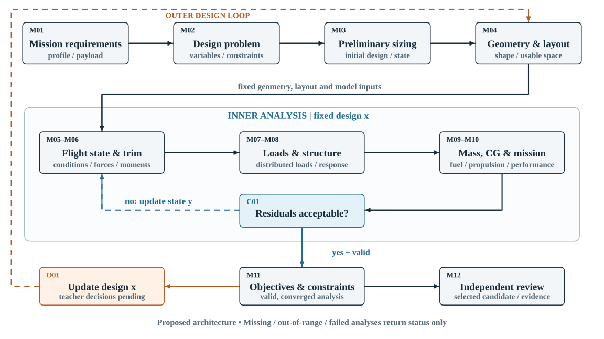
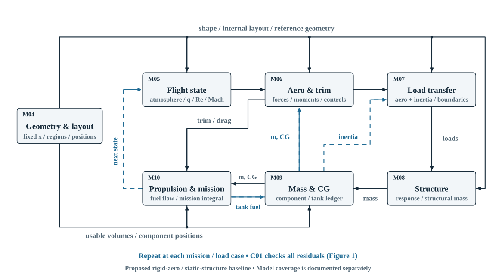

# BWB：实际计算链、有限范围搜索与证据边界

2026-09-10，计算模型 `illustrative-bwb-v2`。本说明对应独立演示的当前实现。固定任务下可生成并比较候选，仍是**低阶工程模型支持的设计搜索**，不是已经验证的飞机，也不是 MIT surrogate 驱动的完整配平与结构系统。[旧版规格快照](https://github.com/hongyi-lab/RapidProcessDesign/blob/dd6244af96214545a698470c18a148107c5017fc/docs/bwb-engineering-pipeline.md)供追溯。

启动和操作见[独立演示说明](../demos/bwb-flow/README_CN.md)。计算以 [engine.py](../demos/bwb-flow/engine.py)、[不可变配置与 schema](../demos/bwb-flow/configuration.py)、[搜索实现](../demos/bwb-flow/optimization.py)为准；页面读取同一计算结果和模块元数据。

## 1. 先看这次候选为什么被选中

默认固定载荷 70 kg、巡航段 500 km、TAS 45 m/s、高度 1500 m，额定载荷、根弦、油箱及模型配置。500 km 是巡航段距离；爬升和下降另外积分，不能称为全任务总航程。目标为降低起始质量，变量为翼展、壁厚、安装功率。这些是**演示设定，正式目标、边界、许用值待导师确认**。

| 量 | 基线 | 本次搜索选中候选 |
|---|---:|---:|
| 翼展 / m | 8 | 7 |
| 蒙皮及翼盒补强层壁厚 / mm | 1.2 | 0.8 |
| 安装轴功率 / kW | 80 | 59.625 |
| 起始质量 / kg | 304.679072 | 250.936341 |
| 装油 / kg | 26.218370 | 23.150932 |

执行41次不重复评价（基线、三水平网格、坐标模式搜索），见[搜索记录](../demos/bwb-flow/evidence/optimization-example.json)。选择已评价且满足演示约束的最小目标。随搜索候选变化的最紧约束是**持续机动功率余量 0.370596 kW**。额定装载 70/70 kg 的余量始终为零，单列为固定任务约束，不把它误写成搜索驱动因素。翼展、厚度触及搜索下界，不证明边界合理或全局最优。

## 2. 两张图分别回答什么



图1展示实际搜索主线。蓝色虚线改变设计，灰色虚线表示独立复核缺口。证据若否定模型/设定，回到定义阶段重新评价。M03明确跳过：从既有尺寸开始，未做任务自动sizing。



图2展开内层：固定硬件先给出质量和截面；燃油试值驱动任务积分，节点更新质量/CG、配平与耗油；闭合后生成载荷并求外翼响应。燃油迭代不重算固定几何或增厚结构；物理依赖与数值更新分开。

## 3. 对象、配置与身份

| 对象 | 当前内容及规则 |
|---|---|
| 需求 r | 本次 `payload_kg`、巡航距离/速度/高度；载荷要求另外存入 `load_case_definition`。任务装载不改变既有系统硬件 |
| 设计 x | 根弦、翼展、壁厚、安装功率、油箱位置/比例、`rated_payload_kg`；材料、截面和硬件质量参数同样参与设计身份 |
| 状态 y | 装油根、任务节点燃油、质量/CG、迎角、舵偏、推力/功率，以及指定载荷下的梁响应 |
| 冻结配置 | `ModelConfig/SolverConfig`为frozen dataclass；函数实际读取，输出独立副本；物理数字规范化为float，避免80与80.0产生不同hash |
| schema | 标签/单位/边界、参数、数值设置及模块说明由 `config_schema()` 输出；未知键、NaN、布尔数值及 `[]/0/空字符串/False` 均拒绝，仅 `None` 表示缺省 |
| 身份 | `design_hash` 区分硬件；`mission_hash` 区分任务；`analysis_hash` 包含设计、任务、载荷定义、配置和代码版本；每次运行另有唯一 `analysis_id` |
| 可比性 | `comparability_hash` 固定任务、载荷定义、模型/求解配置和版本，不含搜索设计。不同任务或模型禁止优劣差值比较 |
| 实际载荷 | `load_case_definition_hash` 描述工况定义；`load_case_hash` 描述本候选实际载荷值；后者随设计改变 |

内部采用m/kg/s/N/Pa/rad；应力MPa、壁厚mm、显示角度deg显式换算；**x向后、y向右、z向上**，俯仰系数正值抬头，未实施六自由度向量变换。

`geometric_quarter_chord_x_m` 是面积加权几何四分之一弦点；旧字段 `xac_m` 只保留兼容别名，不是实测气动中心或模型中性点。

## 4. 每一步怎样算、输出给谁、怎样核查

下文为**已运行的低阶链**；系数和阈值来自冻结配置，不是实机标定值。

### M01–M03：需求、问题与候选来源

M01验证输入域并分开硬件、任务和载荷；M02定义约束，在搜索模式冻结目标、边界和预算。M03均为`skipped / given_candidate`：不从翼载/CLmax反求尺寸。输出r、x及来源到M04/M09和外层；以契约/身份测试核查，不称为尺寸预测验证。

### M04：几何、截面、质量与容积

半翼展 h=b/2；站位 y/h 为 0、0.20、0.55、1，弦长比为 1、0.75、0.35、0.12，三段前缘后掠40°、32°、25°，线性插值给出 c(y)、xLE(y)。求面积、MAC与参考点：

```text
S = 2∫c dy;  MAC = (2/S)∫c² dy
xref = (2/S)∫c(xLE+c/4)dy
d(u) = tc·c·4u(1−u)[1−0.5(2u−1)²],  0≤u≤1
```

面积与二次弦解析积分，参考点用精确Simpson积分。表面z=±d/2，截面积0.6tc·c²，积分得包络体积；未做翼型气动验证。

前后梁在 0.20c、0.55c，翼盒上下补强层跟随同一外形采样为折线，腹板竖直闭合。对每条中心线段长度 ℓ、端点 z₁/z₂、壁厚 t，**薄壁线积分**为：

```text
A = Σtℓ;  zc = Σ[tℓ(z₁+z₂)/2]/A
I = Σ[tℓ(z₁²+z₁z₂+z₂²)/3] − A·zc²;  EI = E·I
```

忽略局部t³项、角部搭接及剪切变形。蒙皮与翼盒补强是分开的两层；EI只计翼盒补强，蒙皮参与质量和惯性卸载。结构质量为全翼蒙皮积分＋两侧外翼翼盒积分＋中央连接质量项。`sections/corners/structural_components` 同时供显示、账本及 M07/M08 使用。

自由容积为`usable_volume_fraction·Vgross−mstruct/ρmaterial`，按载荷/油箱比例分配；油箱容量乘装填比例和燃油密度。仅是容积代理，缺实际装载/CAD验证。以矩形薄壁解析例、质量重构及三维几何检查核查实现。

### M05–M06：大气、配平和功率

M05 由任务/载荷工况的高度和 TAS 计算 ISA 对流层温度、压力、密度、声速、黏度，以及 q=ρV²/2、Re=ρVMAC/μ、Mach=V/a。海平面标准值测试通过；不把此项当气动精度证据。

M06 输入同一几何、工况、当前燃油及 M09 的质量/CG，使用带代表后掠角的有限翼升力斜率 a，解 α/δ 两个未知量：

```text
γ = asin(vz/V);  CLrequired = nmg cosγ/(qS)
a = 2πcosΛ/[1+2cosΛ/(eAR)]
CL = cl0 + aα + clδ·δ
CmCG = cm0 + cmα·α + cmδ·δ + [(xCG−xref)/MAC]CL = 0
CD = cd0 + CL²/(πeAR) + kδ·δ²
D=qSCD;  T=D+mg sinγ;  Prequired=T·V/ηprop
Pavailable=Pinstalled·installation_fraction·ρ/1.225
```

2×2线性方程直接求解；奇异、迎角/舵偏超界、负需用推力功率、功率不足或固定控制 `Cmα,CG=cmα+[(xCG−xref)/MAC]a ≥ 0` 均保留失败工况。默认保护不被求根器删除。输出升阻/配平/功率/残差到M10，载荷工况另供M07。缺失速、真实舵效、推力线矩和CFD/风洞校准。

### M09–M10 / C01：账本、任务积分与燃油根

硬件先固定：结构质量来自 M04，推进质量 `mprop,base+Pinstalled/specific_power`，系统质量 `msys,base+k·rated_payload_kg`，另有固定起落架项。只把本次载荷和当前燃油加入状态；`m=Σmi`，`xCG=Σmixi/m`。安装偏置在返回账本中；油箱质心固定，CG随耗油变化，缺多箱供油和惯量模型。

M10 按爬升、巡航、下降三段积分；默认每段36步，`ṁfuel=−BSFC·Pshaft,kW/3600`，采用显式中点法。每步起点、中点、终点均重新计算质量/CG与配平保护。输出真实时间戳、距离、阶段边界、耗油及最不利状态；图表使用这些时间，不能把长短不同的航段画成等宽。

固定 x 的 C01 求解：

```text
R(fuel0) = fuel0 − [(1+reserve_fraction)·burn(fuel0)+unusable_fuel]
0 ≤ fuel0 ≤ tank_capacity
```

默认记录初猜后扫描101点；失败残差为null，保留阶段/时间/原因。只从**相邻有效且异号**的扫描点建立括区，再二分。遇到括区内部失败立即返回 `fuel_branch_interrupted`，不能跨过未知分支。默认独立残差复核容差 10⁻⁵ kg、二分上限60步。未找到括区返回 `fuel_bracket_not_found / unknown`，有限扫描不构成全域无解证明；合法初猜不决定选取哪个扫描括区。

旧模型油箱偏置0.45MAC的漏解已用冻结原代码重现：原求解失败，同一任务方程存在26.2702146922kg根。新模型截面/质量改变后根为26.2298316167kg，另以独立直接二分和多个合法初猜核查；不能把两个模型数值不同解释成精度改善。C01 不增厚结构、不改变任务、不执行设计优化。

### M07–M08：同一载荷对象与外翼响应

默认载荷为海平面60m/s、输入n的**持续恒速对称机动**，因此保留需用功率检查。可显式切换 `instantaneous`：仍求法向平衡，但由 `m·Vdot=Tavailable−D` 报告纵向加减速；持续功率约束标为不适用，不伪造通过，也不声称瞬时模型覆盖完整机动动力学。

M07 在半翼展中点构造规定椭圆升力，归一化为半侧总升力；从 M04 同一部件描述积分各条带质量，形成 `Fi=Faero,i−n·g·mstruct,i`。这里只提供中点竖向集中力，没有 CFD 压力场、俯仰扭矩、完整载荷包线及外翼非结构部件分布。

M08 **直接消费该对象**的中点位置、力、节点与 hash；不再计算一份未被使用的节点映射来充当接口验证。外翼根 y=0.2h 固支、翼尖自由，截面给 EI：

```text
M(y)=ΣFi(yi−y), yi≥y;  κ=M/EI
θ、w沿翼展用梯形积分；σ=|M|·zmax/I
Rroot=−ΣFi;  Mreaction=−ΣFi(yi−yroot)
```

输出根反力/弯矩、位移和截面应力到 M11；记录 `load_case_hash=consumed_load_case_hash`。检查包括薄壁解析例、均布/三角载荷悬臂解析解、真实载荷合力/力矩和离散加密。梁假设不覆盖扭转、屈曲、疲劳、连接、中央承压舱；结构失败时仍保留已经收敛的任务和燃油结果，但总评价是 unknown。

### M11–M12：约束与独立复核

约束返回值/阈值/单位/方向、`g≤0`、margin=−g、归一化余量及模块/工况/状态/hash。包括油箱、载荷空间、额定装载、任务与机动功率、迎角/舵偏/固定控制稳定性、外翼应力及挠度。默认120MPa应力和外翼长度3%挠度只是演示阈值。持续机动功率与任务功率分列，避免隐藏真正限制候选的工况。

`demo_converged` 只说明所需低阶分析完成；`evaluation_status` 另分 feasible/infeasible/unknown。超应力是有效的不可行评价；缺模型、超域或求解失败不给虚构目标。M12 保持 `not_performed`：尚无独立 CFD/FEA或试验对选中候选的物理复核，`formal_feasibility` 始终 unknown。

## 5. 外层怎样更新设计

`optimization.py` 冻结 r、载荷定义、配置和版本，网格与坐标模式搜索调用同一 `analyze()`。默认范围为翼展[7,10]m、壁厚[0.8,1.6]mm、功率[45,90]kW；三个网格水平先作低维对照，然后沿各设计坐标尝试正负步长。默认初始步长为区间20%，不改善则减半；最多8轮、45次模式搜索评价，步长低于区间1.5%也可停止。总评价预算还包含网格与基线，不能把45误写成全流程上限。

优先选择演示可行点的最小真实目标；有效但不可行点按归一化违约量排序；unknown不填罚值或目标。相同候选缓存复用，每次真实评价留输入、来源、analysis_id/hash、状态和结果；确定性运行，seed=0，不含随机采样。

报告基线、网格最佳、总体选中候选、停止原因、边界命中及最紧约束；“余量≤5%”是显示规则，不是 KKT 活跃约束证明。观测中恒定的约束与随设计变化的约束分开，但也不能据此声称完成灵敏度分析。网格对照和加严同一模型复算均不是独立物理验证。没有找到可行候选不等于设计空间无解。

## 6. MIT接口及UQ边界

同一界面另设[真实 MIT 原生系数适配器](../demos/bwb-flow/model_adapter.py)模式：检查资源hash、decoder、原生字段、几何/飞行盒、Re/Mach、有限数及CD>0后实际调用外部权重。缺失/变化返回诊断；未复制权重进项目。

MIT wrapper能提供 CL/CD/LD/Re/Mach，不能提供 Cm、舵效、分布载荷或结构响应。原生几何比值与本演示三段梯形不是同一decoder，不作隐式映射。论文的规范参考量Sref=1m²、参考长度1m和机鼻矩点可识别，但 wrapper 标签形成/重新归一化链仍缺失；因此适配器 `S_ref/length_ref/moment_reference` 为null，**禁止将其CL直接乘演示平面面积生成力**。轴向盒只表示声明边界，不证明联合训练覆盖。整链分析在求解前检查必需能力及参考量；没有暗中用示例Cm/椭圆载荷补齐MIT。

历史结构CSV审计保留：13,720×28、24输入4输出；质量是结构质量，体积为mm³；不存在可消费新载荷的结构预测权重。重复、热点异常、材料阈值及载荷语义问题详见[资源与模型证据](../demos/bwb-flow/docs/models-evidence.md)和[原始资源审计](evidence/bwb-resource-audit.json)，竞赛评分不作项目目标。

[离线UQ入口](../demos/bwb-flow/uq_evaluate.py)只评估提供的独立参考/预测与切分清单，不训练、不生成误差条。无数据时metrics和uncertainty_metadata为null。清单要求 proper-train/validation/calibration/test在样本和几何组层面分离，并记录完整训练暴露、冻结和保护声明；已有MIT权重训练成员未知，不能随意切出“独立校准集”。声明检查本身也不是数据独立性的外部证明。

区间须带类型、nominal level、校准方法/样本数/版本和适用声明。离线报告MAE/RMSE及已有区间的coverage/width/interval score，按域和选中状态分组。区分surrogate误差、参考模型物理偏差和数值残差；marginal coverage不是飞机/多工况联合可行概率。Shah–Alonso论文的具体比较与GRUBS解释本轮依据用户审阅材料，未完成论文全文独立核对或方法复现。获取新独立标签—更新模型—重新评价候选仍是未来第三条循环；agent继续后置。

## 7. 已执行证据与下一步验证

本轮45项检查通过；核心21项，其余覆盖搜索、模型适配及UQ入口。执行汇总以[verification-v2.json](../demos/bwb-flow/evidence/verification-v2.json)为准；历史 `verification.json` 不能代替本轮记录。

| 证据层 | 本轮能支持什么 | 尚不能支持什么 |
|---|---|---|
| 核心回归/解析检查 | 原8项及新增13项：燃油/配置/身份回归、解析截面/梁、真实载荷接口、加密、局部结果、能力门 | 气动/材料模型在真实飞机上的准确性 |
| 搜索执行 | 默认41次评价及每次候选记录，同 evaluator 的网格对照 | 全局最优性、边界合理性或未建模失效模式安全性 |
| MIT边界与UQ入口 | 原生推理、能力缺口、拒绝越界/泄漏等接口行为 | 已重现训练集精度、已校准置信区间或整机物理验证 |
| 图与UI | 渲染、文本边界、线穿框/文字、字体回退及实际页面检查按本轮证据记录 | 界面颜色或 HTTP 成功不构成工程通过 |

独立验证应先冻结几何/材料/坐标和工况：用独立气动参考核对CL/CD/Cm及舵效；用同边界载荷且已网格收敛的壳模型复核外翼；核实质量、装载和推进图后复核耗油。预先声明参考保真度、误差尺度/预算及用途阈值。偏差要求修订模型/问题并重评基线与候选。

导师需确认任务/载荷、推进/供油、材料/结构覆盖、变量/边界、目标/许用值和独立验证预算；演示默认值不自动成为工程定案。

## 8. 复现和参考入口

在 `demos/bwb-flow` 中运行：

```sh
python -m unittest -v test_engine.py test_core_v2.py test_optimization.py test_models_uq.py
python verify_core_evidence.py
python optimization.py --output evidence/optimization-example.json
python uq_evaluate.py --schema-example
```

图文件：[主图SVG](figures/bwb-engineering-pipeline.svg) / [PNG](figures/bwb-engineering-pipeline.png)，[细节SVG](figures/bwb-analysis-coupling.svg) / [PNG](figures/bwb-analysis-coupling.png)；[可编辑绘图脚本](../scripts/draw_bwb_engineering_pipeline.py)同时生成布局检查记录。浏览器截图和字体回退检查由本轮验证记录定位，不沿用旧版“已可读”的结论。

以下为理论/资源入口；示例参数仍来自演示配置，非资料验证过的BWB数值。

- [MIT Aircraft Range §13.3](https://web.mit.edu/16.unified/www/FALL/thermodynamics/notes/node98.html)：任务质量消耗和简化巡航关系。
- [MIT 16.333 Lecture 2](https://ocw.mit.edu/courses/16-333-aircraft-stability-and-control-fall-2004/resources/lecture_2/)：静稳定与配平概念；不直接移用常规尾翼模型。
- [TU Delft Euler–Bernoulli beam](https://interactivetextbooks.citg.tudelft.nl/computational-modelling/structural_linear/euler_bernouilli.html)：梁方程、边界与离散；本模型仍须受其假设限制。
- [NASA Verification Assessment](https://www.grc.nasa.gov/www/wind/valid/tutorial/verassess.html)：守恒、迭代/空间/时间收敛与证据分层。
- [MIT/nTop固定资源提交](https://github.com/nicksungg/nTop---ASME-IDETC-CIE-Student-Hackathon/tree/b516d4b3e2e5e34fbd5233eacdf15317a96dc2d9)、[BlendedNet++ §3](https://arxiv.org/html/2512.03280v1#S3)：资源身份与参考尺度；论文场模型不等于本地两输出wrapper。
- [Shah–Alonso，DOI 10.2514/6.2026-2023](https://doi.org/10.2514/6.2026-2023)：用户提供的学术方向；当前保留UQ数据/接口边界，不声称复现GRUBS或论文结论。
